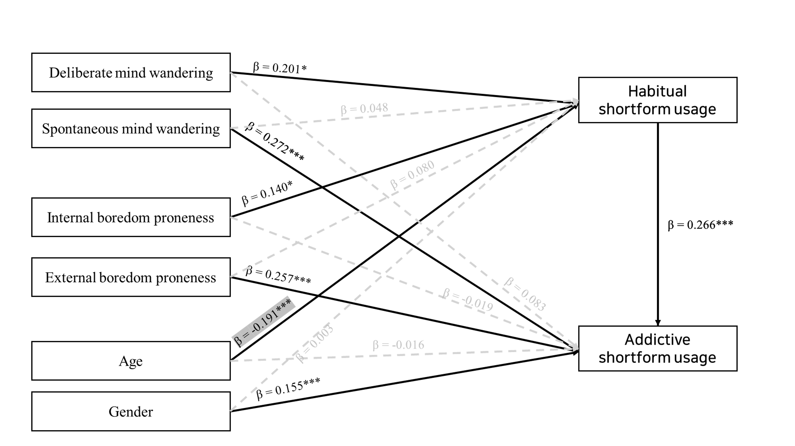

## PLS-SEM_MW_Boredom_Shortform
-------------
- A research exploring psychological factors influencing habitual/addictive shortform usage   
- We used PLS-SEM  for quantitative analysis and fsQCA for Qualitative analysis
- fsQCA is conducted with [fsQCA software](https://sites.socsci.uci.edu/~cragin/fsQCA/software.shtml)

-----------    

--------------------------------

**Reference**   
    
Hair Jr, J. F., Hult, G. T. M., Ringle, C. M., Sarstedt, M., Danks, N. P., & Ray, S. (2021). Partial least squares structural equation modeling (PLS-SEM) using R: A workbook (p. 197). Springer Nature.   
Ragin, Charles C. 2018. User's Guide to Fuzzy-Set/Qualitative Comparative Analysis 3.0. Irvine, California: Department of Sociology, University of California.
